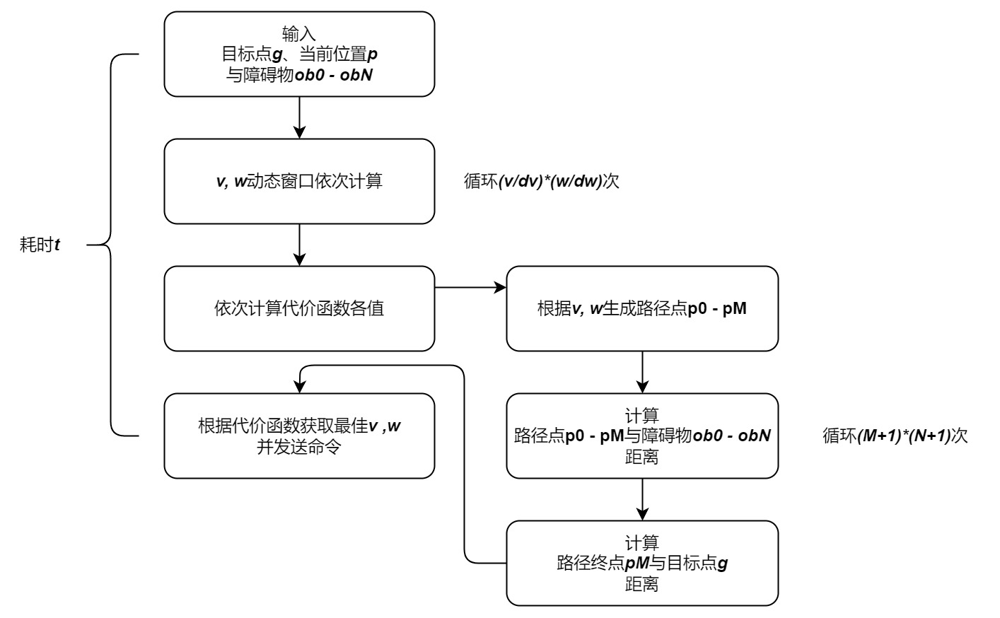
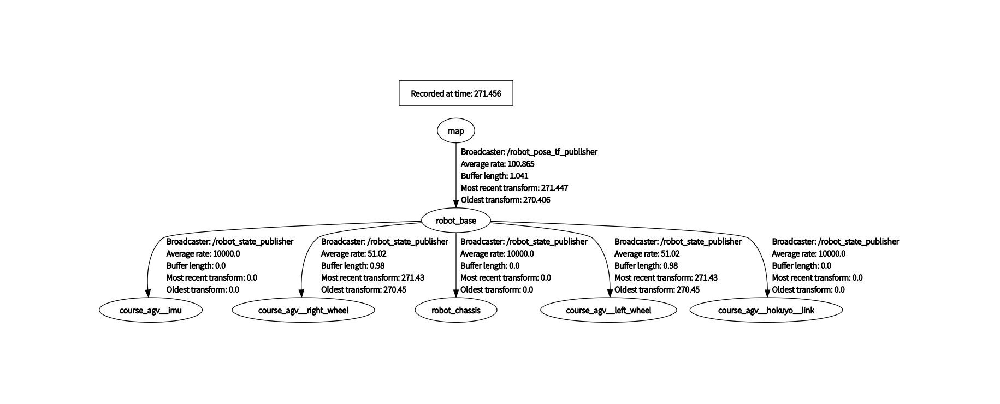
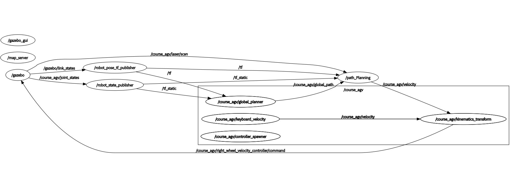
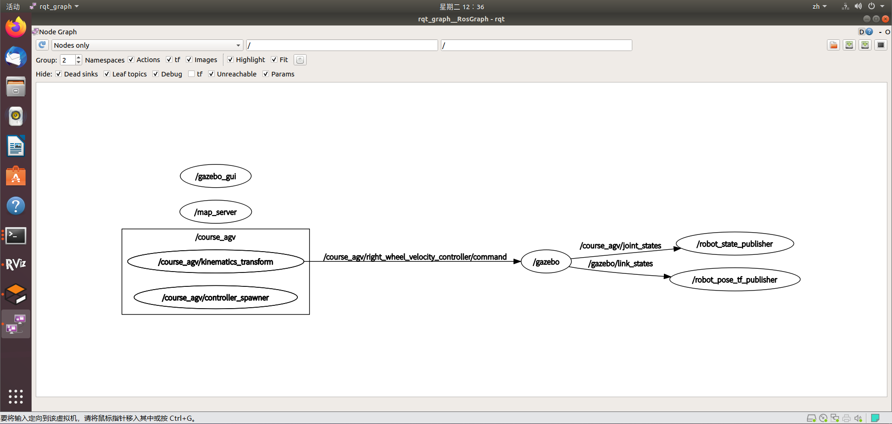
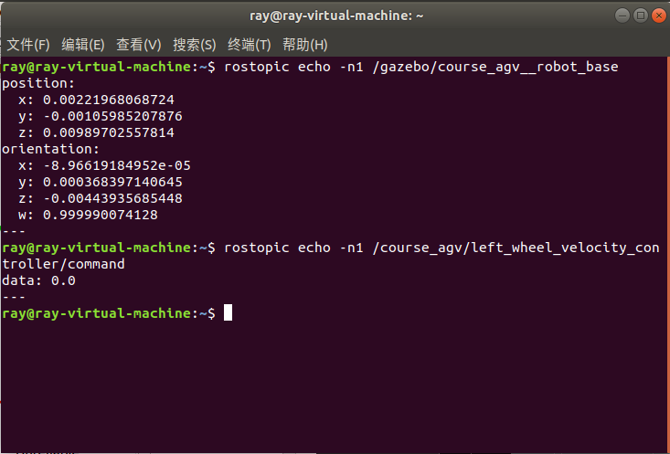

# ZJU-Course2023-Wheeled-Robot-Tech-Practice

### 流程

1. 安装ROS https://blog.csdn.net/qq_41940277/article/details/122608977 【全部】
2. 安装Gazebo https://blog.csdn.net/qq_43193873/article/details/126140130 【仅“三、[Gazebo](https://so.csdn.net/so/search?q=Gazebo&spm=1001.2101.3001.7020)安装”】
3. Rviz https://blog.csdn.net/u010168781/article/details/131204960 【仅“2、启动ROS1-RVIZ”之后】
4. 创建ROS工作空间 https://blog.csdn.net/liu520888/article/details/129070493 【忽略“3.创建和编译功能包”中创建功能包`catkin_create_pkg`一步】
5. 启动.launch文件


### DWA

##### 代价函数

```R
def goalCost(self):
    dX = self.targetPointX - self.motion[-1][0]
    dY = self.targetPointY - self.motion[-1][1]
    distance = math.sqrt(dX * dX + dY * dY)
    if distance > 5:
        return 5
    return distance
    
def angleCost(self):
    angle1 = math.atan2((self.targetPointY - self.motion[-1][1]),
                        (self.targetPointX - self.motion[-1][0]))
    angle2 = self.motion[-1][2]
    dRotation = angle1 - angle2
    return abs(dRotation)
for v in np.arange(vmin, vmax, self.config.v_reso):
    for w in np.arange(wmin, wmax, self.config.yawrate_reso):
        self.path(v, w)
        angleCost = 10 * self.angleCost()
        goalCost = 1 * self.goalCost()
        # obstacleCost=   1 *self.obstacleCost(v)
        velocityCost = 0 * self.velocityCost(v)
        score = goalCost + velocityCost + angleCost
        if score < minScore:
            minScore = score
            bestMotion = self.motion
            bestU = np.array(np.array([v, w]))
```

##### 雷达图（小车、目标点位置与轨迹的可视化）

```R
plt.ion()  # turn on interactive mode
for v in np.arange(vmin, vmax, self.config.v_reso):
    for w in np.arange(wmin, wmax, self.config.yawrate_reso):
        self.path(v, w)
        angleCost = 10 * self.angleCost()
        goalCost = 1 * self.goalCost()
        # obstacleCost=   1 *self.obstacleCost(v)
        velocityCost = 0 * self.velocityCost(v)
        score = goalCost + velocityCost + angleCost
        if score < minScore:
            minScore = score
            bestMotion = self.motion
            bestU = np.array(np.array([v, w]))

plt.clf()  # clear the current figure
plt.xlim(-4, 4)
plt.ylim(-4, 4)
plt.plot(bestMotion[:, 0], bestMotion[:, 1], 'b-')
plt.plot(planGoal[0], planGoal[1], 'rx')
plt.draw()  # draw the current figure
plt.pause(0.01)  # slight pause to allow update of the figure
```

##### 算法改进



假设当前时刻小车速度为$$v_0, w_0$$，DWA算法耗时$$t$$时刻，则小车位置误差为：

$$\begin{array}{l} x = ∫v_0 * \cos(w_0 * t) dt = (v_0/w_0) * \sin(w_0 * t) \\ y = ∫v_0 * \sin(w_0 * t) dt = -(v_0/w_0) * \cos(w_0 * t) \end{array}$$

为保证较小误差，需减小DWA算法耗时

###### 传统做法

```R
# 两个for循环嵌套

def obstacleCost1(self):
    minDistance = 999999
    m=len(self.motion[:,0])
    n=len(self.obstaclePosition[:,0])
    dist=np.zeros([m,n])
    for i in range(m):
        for j in range(n):
            dist[i,j]=np.hypot(self.motion[i,0]-self.obstaclePosition[j,0],
                               self.motion[i,1]-self.obstaclePosition[j,1])
    if dist.min() < 0.2:
        return minDistance
    return dist.min()
```

###### 改进1

```R
# 利用numpy的广播解决省略其中一个for循环

def obstacleCost2(self):
    minDistance = 999999
    m = len(self.motion[:, 0])
    dist = np.zeros([m, 1])
    for i in range(m):
        ox = self.obstaclePosition[:, 0]
        oy = self.obstaclePosition[:, 1]
        dx = self.motion[i, 0] - ox[:, None]
        dy = self.motion[i, 1] - oy[:, None]
        d = np.hypot(dx,dy)
        dist[i]=d.min()
    if dist.min() < 0.2:
        return minDistance
    return dist.min()
```

###### 改进2

```R
# 利用numpy的广播将所有for循环省略

def obstacleCost0(self):
    minDistance=999999
    delta = self.obstaclePosition[:, np.newaxis, :] - self.motion[np.newaxis, :, :2]
    # `delta`的形状为 (n_obstacles, n_motion_points, 2)

    # distance=np.sqrt((delta ** 2).sum(axis=2))
    # minDist = distance[:,3:].min(axis=0)
    # 沿着第三个维度（即每个点与障碍物的距离）取最小值，形状为 (n_motion_points,)

    distance=np.hypot(delta[:,:,0],delta[:,:,1])
    minDist=distance.min()
    if np.any(minDist < 0.2):
        return minDistance
    return minDist.min()
```

###### 对比

以layserscan可用的实际情况为例

路径点为9个，layserscan的障碍物有个200个

| 方法    | 传统     | 改进1  | 改进2  |
| ------- | -------- | ------ | ------ |
| 耗时(s) | 102.5027 | 1.2666 | 1.2896 |

路径点为50个，layserscan的障碍物有个200个

| 方法    | 传统 | 改进1  | 改进2 |
| ------- | ---- | ------ | ----- |
| 耗时(s) | /    | 6.1990 | 8.484 |

###### 可能的原因

1. **内存使用：** 在"改进2"中，你使用numpy广播机制创建了一个形状为`(n_obstacles, n_motion_points, 2)`的新数组。对于大规模数据，这可能会消耗大量内存，从而导致性能下降。而在"改进1"中，你的计算在每次循环时只处理一个motion点和所有obstacle点之间的距离，这大大减少了内存的使用。
2. **数据访问和缓存：** 在"改进1"中，你一次处理一个motion点，这可能允许处理器更有效地使用其缓存，因为它可以在每次循环中重复使用obstacle点的数据。相比之下，"改进2"中，处理器可能需要更频繁地从内存中获取数据，这可能会导致缓存效率降低。


### 最终ROS可视化

##### rqt_tf_tree



##### rqt_graph




### 指令（不用参考）

##### 启动

```Shell
roscore
sudo vmhgfs-fuse .host:/ /mnt/hgfs -o allow_other

cd /mnt/hgfs/ros_ws
source devel/setup.bash
roslaunch course_agv_nav nav.launch

rostopic echo /course_agv/velocity
rostopic echo /course_agv/left_wheel_velocity_controller/command
rostopic echo /course_agv/right_wheel_velocity_controller/command
python /mnt/hgfs/ros_ws/src/course_agv_nav/scripts/local_planner.py
python3 /mnt/hgfs/ros_ws/src/course_agv_control/scripts/keyboard_velocity.py
```

##### 查看

```Shell
rosrun rqt_graph rqt_graph
```



```Python
rostopic echo -n1 /gazebo/course_agv__robot_base
rostopic echo -n1 /course_agv/left_wheel_velocity_controller/command
```




### 参考链接

- 去年课程代码仓库 https://github.com/Nlict-RC/course2022_Robotics_Design-Practice/tree/master
- 另一个 https://github.com/jyczju/Mobile-Robot-Control/tree/main
- 没有共享目录 https://blog.csdn.net/weixin_56879408/article/details/127943969
- 网课 https://www.bilibili.com/video/BV1mJ411R7Ni/?p=18&t=3